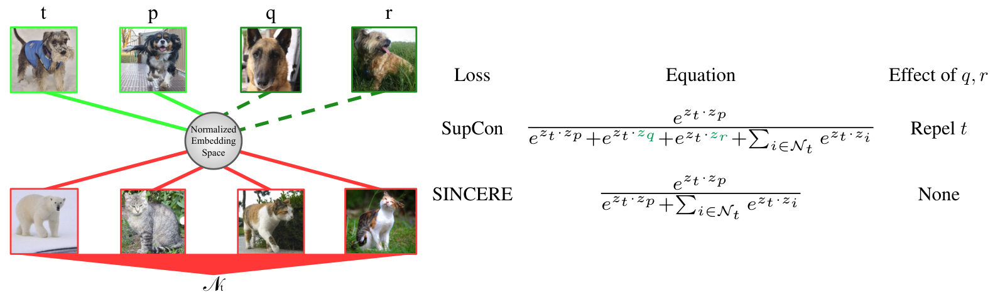

# SINCERE: Supervised Information Noise-Contrastive Estimation REvisited
<p align="center">
  
</p>

This repo covers an reference implementation of the SINCERE loss in Pytorch for training on CIFAR-10 and CIFAR-100.

## Loss Function
Three loss functions are provided in `revised_losses.py`:

1. `MultiviewSINCERELoss` for supervised learning **with multiple augmentations** of the images. This is the loss used in experiments.
1. `SINCERELoss` for supervised learning **without multiple augmentations** of the images.
1. `InfoNCELoss` for **self-superviesd learning** with multiple augmentations of the images.

## Installation

The following instructions should be done with Python 3.10 to create a Pipenv with all required packages installed. If you do not have Pipenv installed, run the following:
```
pip install pipenv
```
The dependencies can be installed within a Pipenv with the following commands:
```
pipenv install --categories "packages torch_cpu"
```
PyTorch may require different versions depending on the machine it is running on. The default command is for non-CUDA machines while swapping `torch_cpu` for `torch_cu117` installs PyTorch for CUDA 11.7. If a non-default version of PyTorch is required then generate the appropriate Pip command on the [PyTorch website](https://pytorch.org/get-started/locally/) then run it within the Pipenv by prepending ```pipenv run``` to it.

## Running

The dataset defaults to CIFAR-10, but CIFAR-100 can be used by adding `--dataset cifar100`.
The baseline SupCon loss can be used by using `--implementation old` instead of `--implementation new`.
 
### SINCERE Pretraining Stage:
```
python main_supcon.py --batch_size 512 \
  --learning_rate 0.5 \
  --temp 0.1 \
  --cosine \
  --implementation new
```

### Cross-Entropy Linear Finetuning Stage:
```
python main_linear.py --batch_size 512 \
  --learning_rate 5 \
  --ckpt /path/to/model.pth
```
